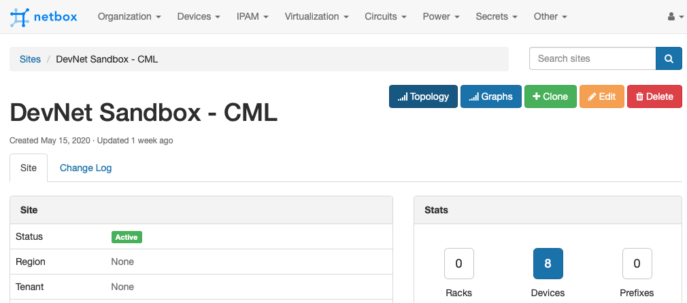
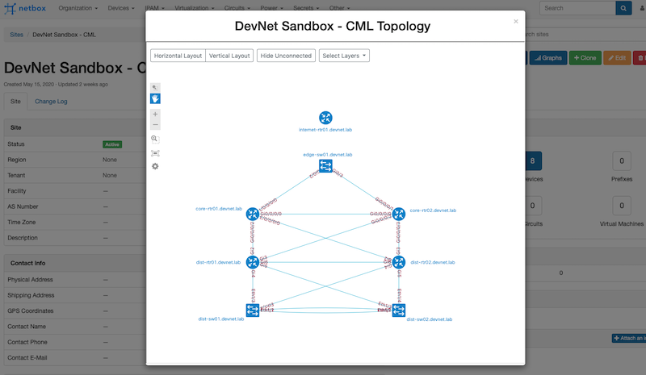
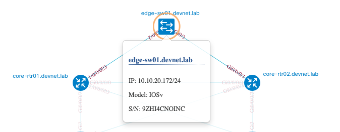

# NextBox UI Plugin

A topology visualization plugin for [Netbox](https://github.com/netbox-community/netbox) powered by [NextUI](https://developer.cisco.com/site/neXt/) Toolkit. Netbox v2.8.0+ is required.

# Installation
The Plugin currently requires a manual installation.<br/>
The source code is available on [GitHub](https://github.com/iDebugAll/nextbox-ui-plugin).

General installation steps and considerations follow the [official guidelines](https://netbox.readthedocs.io/en/stable/plugins/).

### Package Installation
Download and install the package. Assuming you use a Virtual Environment for Netbox:
```
$ git clone https://github.com/iDebugAll/nextbox-ui-plugin
$ cd nextbox-ui-plugin
$ source /opt/netbox/venv/bin/activate
(venv) $ pip3 install .
```

### Enable the Plugin
In a global Netbox **configuration.py** configuration file, update or add PLUGINS parameter:
```python
PLUGINS = [
    'nextbox_ui_plugin',
]
```

Optionally, update a PLUGINS_CONFIG parameter in **configuration.py** to rewrite default plugin behavior:
```python
#PLUGINS_CONFIG = {
#    'nextbox_ui_plugin': {
#        'layers_sort_order': (
#            ADD YOUR SETTINGS HERE
#            layer_sort_order is a tuple
#        ),
#        'icon_model_map': {
#            ADD YOUR SETTINGS HERE
#            icon_model_map is a dict
#        },
#    }
#}
```
By default, the Plugin orders devices on a visualized topology based their roles in Netbox device attributes.<br/> This order may be controlled by 'layers_sort_order' parameter. Default sort order includes most commonly used naming conventions:
```
(
    'undefined',
    'outside',
    'border',
    'edge',
    'edge-switch',
    'edge-router',
    'core',
    'core-router',
    'core-switch',
    'distribution',
    'distribution-router',
    'distribution-switch',
    'leaf',
    'spine',
    'access',
    'access-switch',
)
```

By default, the Plugin automatically tries to identify the device icon type based on following logic:
1. 'icon_{icon_type}' tag in the Netbox Device tags.
   Assign a tag to the device to manually control the displayed icon type (e.g. 'icon_router' or 'icon_switch').
   Supported icon types:
```
{
    'switch',
    'router',
    'firewall',
    'wlc',
    'unknown',
    'server',
    'phone',
    'nexus5000',
    'ipphone',
    'host',
    'camera',
    'accesspoint',
    'groups',
    'groupm',
    'groupl',
    'cloud',
    'unlinked',
    'hostgroup',
    'wirelesshost',
}
```
2. If no valid 'icon_{icon_type}' tags found, the Plugin checks the default icon to device_type mapping. You can control this behavior with 'icon_model_map' dict. The Plugin checks for substring in a full device_type attribute. Default mapping:

```
{
    'CSR1000V': 'router',
    'Nexus': 'switch',
    'IOSXRv': 'router',
    'IOSv': 'switch',
    '2901': 'router',
    '2911': 'router',
    '2921': 'router',
    '2951': 'router',
    '4321': 'router',
    '4331': 'router',
    '4351': 'router',
    '4421': 'router',
    '4431': 'router',
    '4451': 'router',
    '2960': 'switch',
    '3750': 'switch',
    '3850': 'switch',
    'ASA': 'firewall',
}
```
Keys are searched substrings. Keys should be valid icon types as listed above.

3. Default value is 'unknown' (renders as a question mark icon).

### Collect Static Files
The Plugin contains static files for topology visualization. They should be served directly by the HTTP frontend. In order to collect them from the package to the Netbox static root directory use the following command:
```
(venv) $ cd /opt/netbox/netbox/
(venv) $ python3 manage.py collectstatic
```

### Restart Netbox
Restart the WSGI service to apply changes:
```
sudo systemctl restart netbox
```

# Installation with Docker
The Plugin may be installed in a Netbox Docker deployment. 
The package contains a Dockerfile for [Netbox-Community Docker](https://github.com/netbox-community/netbox-docker) extension. Latest-LDAP version is used by default as a source.<br/>
Download the Plugin and build from source:
```
$ git clone https://github.com/iDebugAll/nextbox-ui-plugin
$ cd nextbox-ui-plugin
$ docker build -t netbox-custom .
```
Update a netbox image name in **docker-compose.yml** in a Netbox Community Docker project root:
```yaml
services:
  netbox: &netbox
    image: netbox-custom:latest
```
Update a **configuration.py**. It is stored in netbox-docker/configuration/ by default. Update or add PLUGINS parameter and PLUGINS_CONFIG parameter as described above.

Rebuild the running docker containers:
```
$ cd netbox-docker
$ docker-compose down
$ docker-compose up -d
```
Netbox Community Docker setup performs static files collection on every startup. No manual actions required.

# Usage

Once installed and initialized, the Plugin runs on a backend. It currently supports topology visualization for Netbox Sites. Only direct Cables between the Devices are currently supported for links visualization. Devices without any connections are displayed on the topology.<br/>
<br/>
Site topology visualization may be accessed in two different ways:
1. By clicking a custom plugin Topology button on a Site page.

The topology visualization will open in a pop-up window:

Nodes are dragable and clickable:

You can switch between vertical and horizontal layers sort order back and forth. Default is vertical.
2. Directly via /plugins/nextbox-ui/site_topology/{site_id}. This is helpful in case if you need an embedded topology frame on some of your side resources.
<br/>

### Required Netbox User Permissions
The Plugin requires the following user permissions in order to access topology view:

  - dcim | site   | Can read site
  - dcim | device | Can view device
  - dcim | cable  | Can view cable