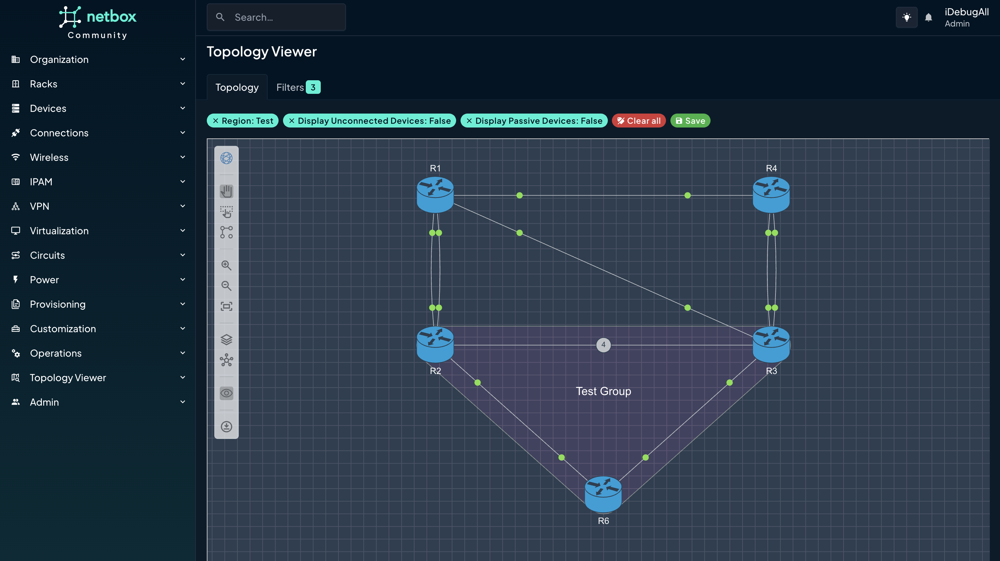

# NextBox UI Plugin

NextBox UI is a Next Generation topology visualization plugin for [NetBox](https://github.com/netbox-community/netbox) powered by topoSphere SDK.<br/>

The Plugin delivers adaptive and scalable network topology maps, featuring advanced auto-layout algorithms, extended Filters, and multiple export options. Designed for efficiency and flexibility, NextBox UI enhances the visualization and management of complex network infrastructures within NetBox, providing users with intuitive tools to customize views, streamline network planning, and facilitate comprehensive data analysis.


*Now with Dark Mode!*


# Compatibility

Newest NextBox UI Plugin versions 1.X support NetBox 4.1.<br/>

Legacy NextBox UI Plugin version 0.15 support NetBox 3.5-4.1.

# Installation

General installation steps and considerations follow the [official guidelines](https://netbox.readthedocs.io/en/stable/plugins/).

### Package Installation from PyPi

Assuming you use a Virtual Environment for Netbox:
```
$ source /opt/netbox/venv/bin/activate
(venv) $ pip3 install nextbox-ui-plugin
```

### Package Installation from Source Code
The source code is available on [GitHub](https://github.com/iDebugAll/nextbox-ui-plugin).<br/>
Download and install the package. Assuming you use a Virtual Environment for Netbox:
```
$ git clone https://github.com/iDebugAll/nextbox-ui-plugin
$ cd nextbox-ui-plugin
$ source /opt/netbox/venv/bin/activate
(venv) $ pip3 install .
```

To ensure NextBox UI plugin is automatically re-installed during future upgrades, create a file named `local_requirements.txt` (if not already existing) in the NetBox root directory (alongside `requirements.txt`) and list the `nextbox-ui-plugin` package:

```no-highlight
# echo nextbox-ui-plugin >> local_requirements.txt
```

### Enable the Plugin
In a global Netbox **configuration.py** configuration file, update or add PLUGINS parameter:
```python
PLUGINS = [
    'nextbox_ui_plugin',
]
```

Optionally, update a PLUGINS_CONFIG parameter in **configuration.py** to rewrite default plugin behavior:
```python
#PLUGINS_CONFIG = {
#    'nextbox_ui_plugin': {
#        'layers_sort_order': (
#            ADD YOUR SETTINGS HERE
#            layer_sort_order is a tuple
#        ),
#        'icon_model_map': {
#            ADD YOUR SETTINGS HERE
#            icon_model_map is a dict
#        },
#        'icon_role_map': {
#            ADD YOUR SETTINGS HERE
#            icon_role_map is a dict
#        }
#        'INITIAL_LAYOUT': 'auto' # or 'layered'
#    }
#}
```
By default, the Plugin orders devices on a visualized topology based their roles in Netbox device attributes.<br/> This order may be controlled by 'layers_sort_order' parameter. Default sort order includes most commonly used naming conventions:
```
(
    'undefined',
    'outside',
    'border',
    'edge',
    'edge-switch',
    'edge-router',
    'core',
    'core-router',
    'core-switch',
    'distribution',
    'distribution-router',
    'distribution-switch',
    'leaf',
    'spine',
    'access',
    'access-switch',
)
```

By default, the Plugin automatically tries to identify the device icon type based on following logic:
1. 'icon_{icon_type}' tag in the Netbox Device tags.
   Assign a tag to the device to manually control the displayed icon type (e.g. 'icon_router' or 'icon_switch').
   Supported icon types:
```
{
    'switch',
    'router',
    'firewall',
    'wlc',
    'unknown',
    'server',
    'phone',
    'nexus5000',
    'ipphone',
    'host',
    'camera',
    'accesspoint',
    'groups',
    'groupm',
    'groupl',
    'cloud',
    'unlinked',
    'hostgroup',
    'wirelesshost',
}
```
2. If no valid 'icon_{icon_type}' tags found, the Plugin checks the default icon to device_type mapping. You can control this behavior with 'icon_model_map' dict. The Plugin checks for substring in a full device_type attribute. Default mapping:

```
{
    'CSR1000V': 'router',
    'Nexus': 'switch',
    'IOSXRv': 'router',
    'IOSv': 'switch',
    '2901': 'router',
    '2911': 'router',
    '2921': 'router',
    '2951': 'router',
    '4321': 'router',
    '4331': 'router',
    '4351': 'router',
    '4421': 'router',
    '4431': 'router',
    '4451': 'router',
    '2960': 'switch',
    '3750': 'switch',
    '3850': 'switch',
    'ASA': 'firewall',
}
```
Keys are searched substrings. Values should be valid icon types as listed above.<br/>

3. If no match found on steps 1-2, the Plugin checks the Device Role slug to Icon mapping.<br/>
This mapping may be defined within 'icon_role_map' dict in Plugin parameters.<br/>
Default mapping already contains some general categories:
```
{
    'border': 'router',
    'edge-switch': 'switch',
    'edge-router': 'router',
    'core-router': 'router',
    'core-switch': 'switch',
    'distribution': 'switch',
    'distribution-router': 'router',
    'distribution-switch': 'switch',
    'leaf': 'switch',
    'spine': 'switch',
    'access': 'switch',
    'access-switch': 'switch',
}
```

4. Default value is 'unknown'.
<br/><br/>


Device layers are ordered automatically by default. You can control this behavior with INITIAL_LAYOUT plugin parameter. Valid options are 'layered', and 'auto'.<br/>
'auto' layout relies on topoSphere best-effort algorithms. It spreads the Nodes across the view so they would be as distant from each other as possible.


### Collect Static Files
The Plugin contains static files for topology visualization. They should be served directly by the HTTP frontend. In order to collect them from the package to the Netbox static root directory use the following command:
```
(venv) $ cd /opt/netbox/netbox/
(venv) $ python3 manage.py collectstatic
```

### Restart Netbox
Restart the WSGI service to apply changes:
```
sudo systemctl restart netbox
```

# Installation with Docker
The Plugin may be installed in a Netbox Docker deployment. 
The package contains a Dockerfile for [Netbox-Community Docker](https://github.com/netbox-community/netbox-docker) extension. Latest-LDAP version is used by default as a source.<br/>
Download the Plugin and build from the source:
```
$ git clone https://github.com/iDebugAll/nextbox-ui-plugin
$ cd nextbox-ui-plugin
$ docker build -t netbox-custom .
```
Update a netbox image name in **docker-compose.yml** in a Netbox Community Docker project root:
```yaml
services:
  netbox: &netbox
    image: netbox-custom:latest
```
Update a **configuration.py**. It is stored in netbox-docker/configuration/ by default. Update or add PLUGINS parameter and PLUGINS_CONFIG parameter as described above.

Rebuild the running docker containers:
```
$ cd netbox-docker
$ docker-compose down
$ docker-compose up -d
```
Netbox Community Docker setup performs static file collection and database migrations on every startup. No manual actions are required.

# Fixing Common Installation and Post-Upgrade Issues

If you are experiencing some unexpected errors or visual behaviors after the installation or upgrade, please make sure that you execute the following steps first:

1. Clear your browser cache and reload the page.
2. Re-collect static files: `(venv) $ python3 manage.py collectstatic --clear`.
3. Re-apply database migrations: `(venv) $ python3 manage.py migrate`.

# Usage

Once installed and initialized, the Plugin will be available via Topology Viewer main menu item in NetBox.


### Required Netbox User Permissions
The Plugin requires the following user permissions to access the topology view:

  - dcim | site   | Can read site
  - dcim | device | Can view device
  - dcim | cable  | Can view cable

# Licensing

Plugin code is published under MIT license. Embedded topoSphere SDK bundle is published under proprietary license special for NextBox UI Plugin and NetBox Community free of charge.
